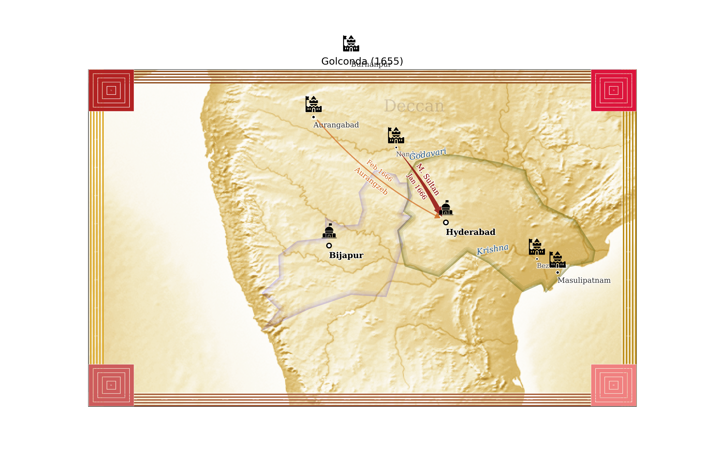
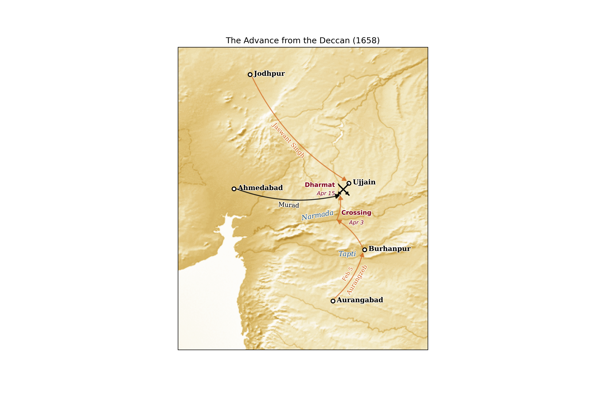
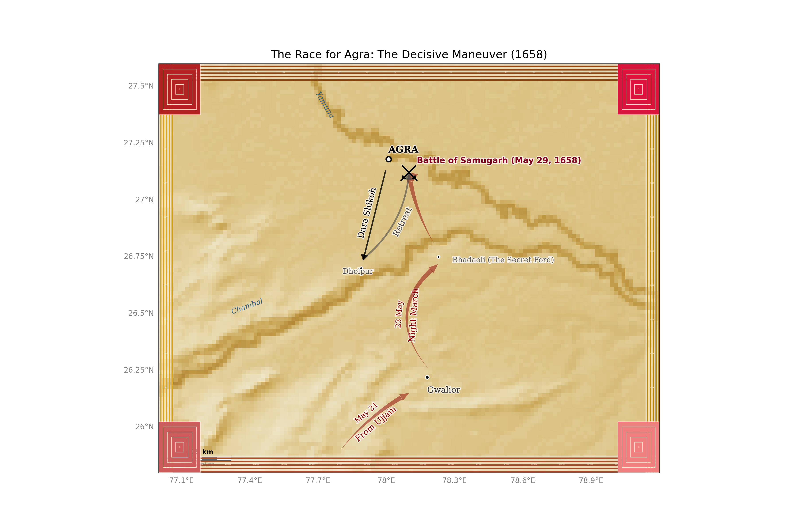

# History Cartopy

Create beautiful historical maps from declarative YAML manifests.

## Example Maps

| Sack of Hyderabad (1655) | Advance from Deccan (1658) | Tactical Agra (1658) |
|:------------------------:|:--------------------------:|:--------------------:|
|  |  |  |

## Features

- Declarative YAML-based map configuration
- Support for territories (geoJSON), cities, campaigns, and labels
- Tiled PNG border system with customizable styles

## Installation

### Prerequisites

- Python 3.9 or higher
- GEOS library

On Ubuntu/Debian:
```bash
sudo apt install libgeos-dev
```

On macOS:
```bash
brew install geos
```

### Install from source

```bash
git clone https://github.com/chetanvaity/history-cartopy.git
cd history-cartopy
pip install -e .
```

### Set up backgrounds

The excellent TIF images from Natural Earth are downloaded using:
```bash
history-map --init
```

## Map Configuration

### Manifest Structure

Maps are defined in YAML manifests:

```yaml
metadata:
  title: "Map Title"
  year: 1655
  extent: [70, 85, 13, 23]  # [MinLon, MaxLon, MinLat, MaxLat]
  resolution: "dev"  # dev, low, med, high
  output: "output.png"
  dimensions: [3600, 2400]  # pixels (width × height) - must be 3:2 ratio
  border_style: "mughal"  # optional - references data/borders/mughal/

labels:
  capitals:
    - name: Hyderabad
  cities:
    - name: Aurangabad
  rivers:
    - name: "Krishna"
      coords: [79.2, 16.6]
      rotation: 10

campaigns:
  - path: ["Aurangabad", "Hyderabad"]
    style: "invasion"
    label_above: "Aurangzeb"

territories:
  - name: "Kingdom"
    file: "kingdom.geojson"
    style: "kingdom1"
    type: "edge-tint"
```

### Dimension Requirements

**Aspect Ratio:**
- Maps must maintain **3:2 landscape** aspect ratio (width:height = 1.5)
- Examples: 3000×2000, 3600×2400, 4800×3200

## Usage

```bash
# Render a map
history-map examples/war-of-succession.yaml

# Specify output filename
history-map examples/war-of-succession.yaml --output my-map.png

# Save without displaying (for SSH sessions or scripts)
history-map examples/war-of-succession.yaml --no-show

# Override background image resolution (dev, low, med, high)
history-map examples/war-of-succession.yaml --res high
```

## Creating Historical Maps

1. Define your map in a YAML manifest (see `examples/reference-manifest.yaml`)
2. Create or reuse GeoJSON files for territories (Only if you use territories)
3. Render the map: `history-map your-manifest.yaml`

## License

MIT License - see [LICENSE](LICENSE) for details.
